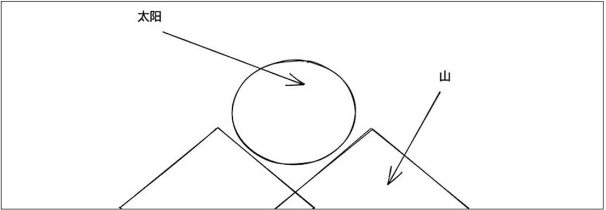
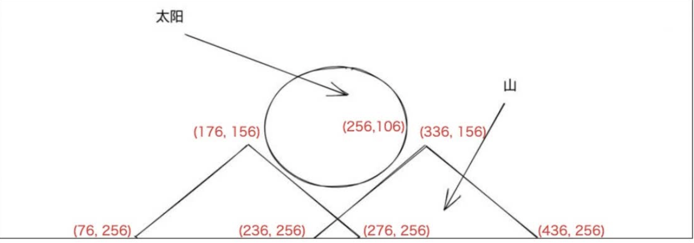

## 1. 在宽 512 * 高 256 的一个 Canvas 画布上实现如下的视觉效果。


思路分析：由于我们知道canvas的坐标系是屏幕的左上方，往右是x轴，往下是y轴，我们通过计算可以算出我们想要的各个点的坐标，如下图


**我们采用roughjs绘图绘制的漂亮些**

### 根据实际坐标绘制图形
```ts

var canvas = document.getElementById("app") as HTMLCanvasElement;
canvas.width = 512;
canvas.height = 512;
// 采用绝对坐标系
const ctx = canvas.getContext("2d");
const rc = rough.canvas(canvas);
const hillOpts = { roughness: 2.8, strokeWidth: 2, fill: "blue" };
rc.path("M76 256L176 156L276 256", hillOpts);
rc.path("M236 256 L336 156 L436 256", hillOpts);
rc.circle(256, 106, 105, {
  stroke: "red",
  strokeWidth: 4,
  fill: "rgba(255,255,0,0.4)",
  fillStyle: "solid",
});

```

缺点：每次改动或者重新绘制时，我们需要重新计算各个点的值，这样导致计算量很大

### 转换坐标系绘制图形
```ts
// 转换代码
ctx.translate(256, 512);
ctx.scale(1, -1);
```
**让坐标中心在，在屏幕中心的底部，y轴向上;**

```ts
ctx.translate(256, 512);
ctx.scale(1, -1);
ctx.lineCap = "round";
// 根据变换后坐标系的原点进行坐标计算。
rc.path("M-180 0L-80 100L20 0", hillOpts);
rc.path("M-20 0L80 100L180 0", hillOpts);
rc.circle(0, 150, 105, {
  stroke: "red",
  strokeWidth: 4,
  fill: "rgba(255,255, 0, 0.4)",
  fillStyle: "solid",
});

```


